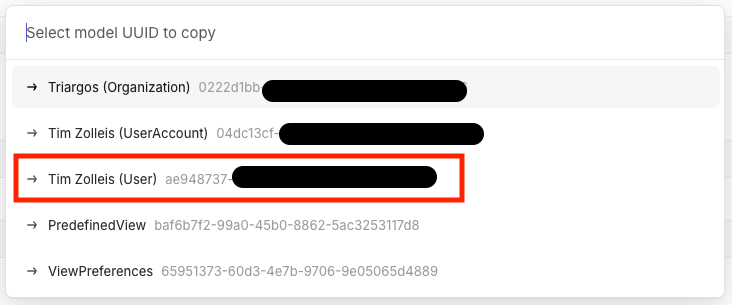

# Linear Outlook Sync

A service that automatically syncs Outlook calendar events with Linear triage responsibilities, enabling automatic assignment of team members based on calendar schedules.

## What it does

This service monitors your Outlook calendar for events matching a specified pattern and automatically assigns the scheduled person to Linear triage responsibilities. When an event is scheduled for today, it will:

1. **Fetch Events**: Retrieves calendar events from the specified Outlook calendar
2. **Find Next Event**: Locates the next event matching your configured regex pattern
3. **Extract Assignment**: Determines which team member should be assigned based on the event subject
4. **Update Linear**: Creates or updates the Linear triage responsibility to notify the assigned user

## Configuration

The service requires the following environment variables to be configured:

### Linear Configuration

- `LINEAR_AUTH_API_KEY`: Your Linear API key for accessing the Linear API
- `LINEAR_TEAM_ID`: The Linear team ID where triage responsibilities should be managed
- `USERS_*`: Mapping of user names to Linear user IDs (see examples below)

### Outlook Configuration

- `OUTLOOK_CALENDAR_EMAIL`: The email address of the Outlook calendar to monitor
- `OUTLOOK_EVENT_REGEX`: Regular expression pattern to match calendar events (e.g., `hotline`)
- `OUTLOOK_AUTH_TENANT_ID`: Azure AD tenant ID
- `OUTLOOK_AUTH_CLIENT_ID`: Azure AD application client ID
- `OUTLOOK_AUTH_CLIENT_SECRET`: Azure AD application client secret

## OUTLOOK_EVENT_REGEX Feature

The `OUTLOOK_EVENT_REGEX` configuration allows you to customize which calendar events should be processed for triage assignment. This regex pattern is used to identify relevant events in your calendar.

### Example Configuration

```bash
OUTLOOK_EVENT_REGEX="hotline|support"
```

### How it works

The service looks for calendar events with subjects that contain both a username and the regex pattern. The regex is flexible and allows various formats:

**Example with `OUTLOOK_EVENT_REGEX="hotline|support"`:**

✅ **Matching events:**
- `"John hotline duty"` → matches, assigns to John
- `"Support rotation - Sarah"` → matches, assigns to Sarah  
- `"hotline Mike coverage"` → matches, assigns to Mike
- `"MM Hotline"` → matches, assigns to MM
- `"support Emma today"` → matches, assigns to Emma
- `"on-call Alex rotation"` → matches if regex includes "on-call"

❌ **Non-matching events:**
- `"Team meeting"` → ignored (no regex match)
- `"John on vacation"` → ignored (no regex match)
- `"hotline duty today"` → ignored (no username found)

### User Mapping Example

Configure user mappings to link calendar names with Linear user IDs:

```bash
USERS_JOHN="550e8400-e29b-41d4-a716-446655440000"
USERS_SARAH="660e8400-e29b-41d4-a716-446655440001" 
USERS_MIKE="770e8400-e29b-41d4-a716-446655440002"
USERS_MM="880e8400-e29b-41d4-a716-446655440003"
```

This will match calendar subjects like:
- `"John hotline duty"` → assigns Linear user `550e8400-e29b-41d4-a716-446655440000`
- `"Support Sarah today"` → assigns Linear user `660e8400-e29b-41d4-a716-446655440001`
- `"MM Hotline"` → assigns Linear user `880e8400-e29b-41d4-a716-446655440003`

## Setup Instructions

1. **Clone and install dependencies**
   ```bash
   git clone <repository>
   cd packages/linear-outlook-sync
   npm install
   ```

2. **Configure environment variables**
   
   Copy the example environment file and fill in your values:
   ```bash
   cp .env.example .env
   ```

3. **Set up Azure AD Application**
   
   Register an application in Azure AD with the following permissions:
   - `Calendars.Read` (Application permission)
   - Configure client credentials (client secret)

4. **Get Linear API Key**
   
   Generate an API key from your Linear settings with access to triage responsibilities.

5. **Get Linear User IDs**
   
   For each team member you want to map in the calendar events:
   
   1. Open Linear and navigate to a page relating to the user (user profile, or hover over them in the members overview)
   2. Open the command palette with `Cmd+K` (Mac) or `Ctrl+K` (Windows/Linux)
   3. Type "copy model uuid" and press Enter
   4. The user's Linear ID will be copied to your clipboard
   
     

   Use these IDs in your environment configuration as `USERS_{SHORTNAME}={linear_user_id}`.

    > Example: `USERS_MM=f64bee33-6d13-49ba-9a6f-8c95d7b5b782`


## How it works

The service runs once per execution and:

1. Loads configuration from environment variables
2. Authenticates with Microsoft Graph API using client credentials
3. Fetches calendar events from the specified Outlook calendar
4. Filters events using the configured regex pattern
5. Finds the next event occurring today or in the future
6. Extracts the assigned user from the event subject
7. Updates or creates a Linear triage responsibility for the team


## Development

### Project Structure

```
src/
├── auth/           # Microsoft Graph authentication
├── calendar/       # Outlook calendar integration  
├── config/         # Configuration management
├── hotline-event/  # Event processing logic
├── graph/          # Graph API client
└── main.ts         # Application entry point
```

### Running Tests

```bash
pnpm test
```
